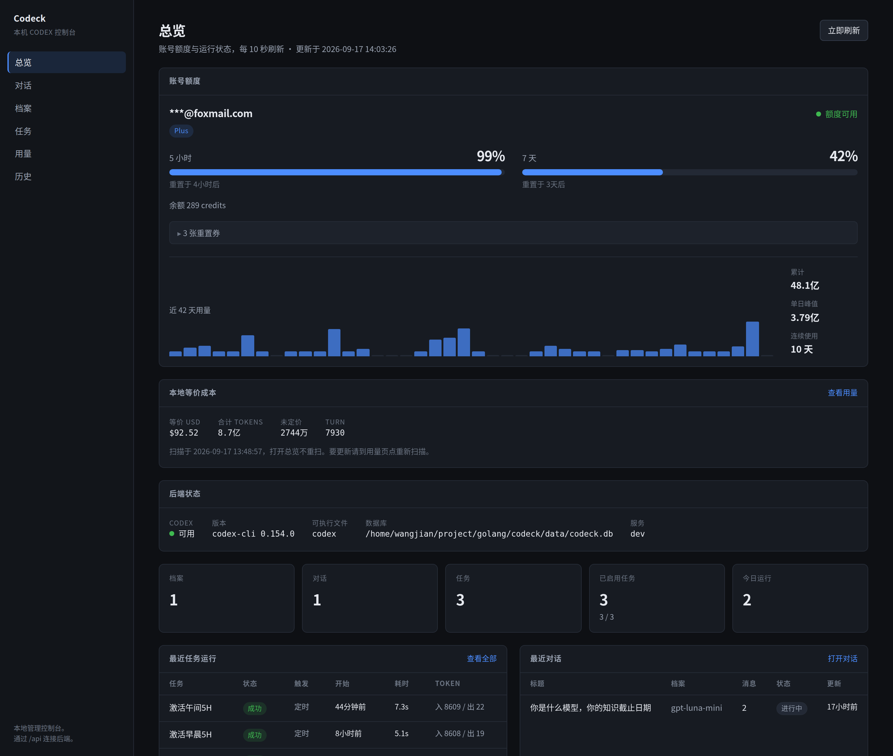
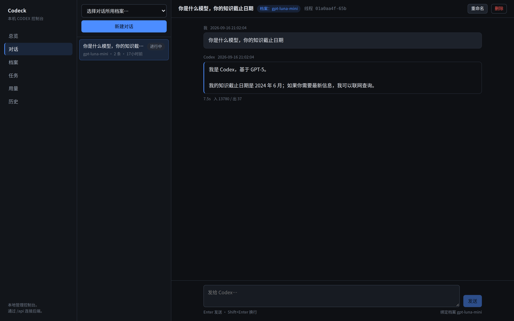
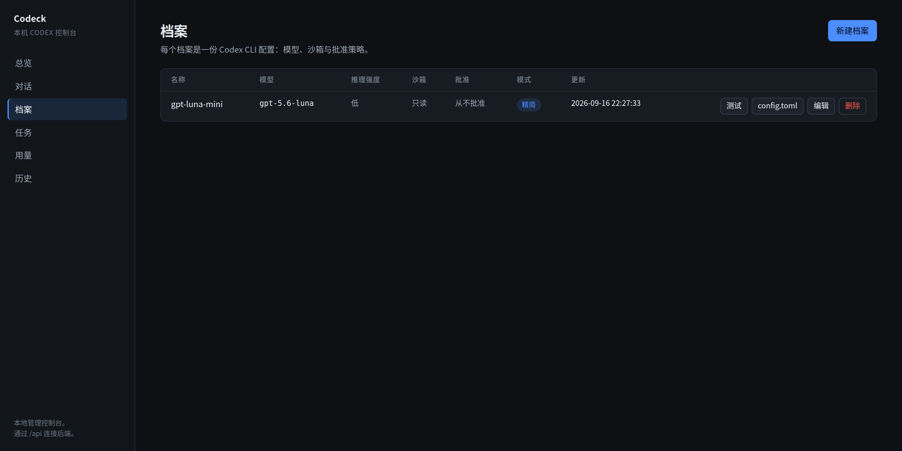
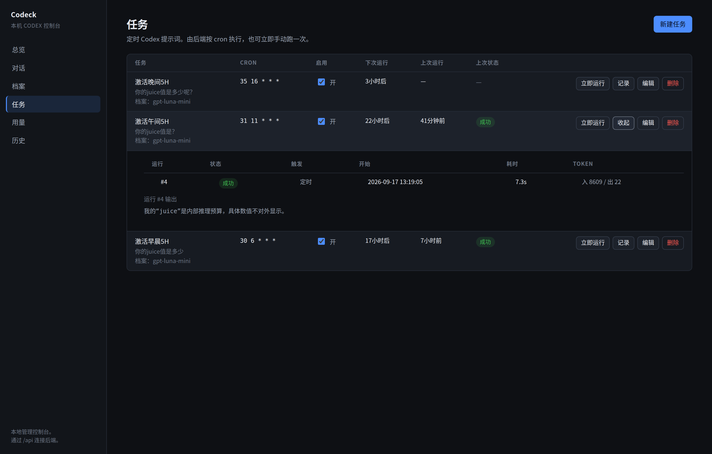
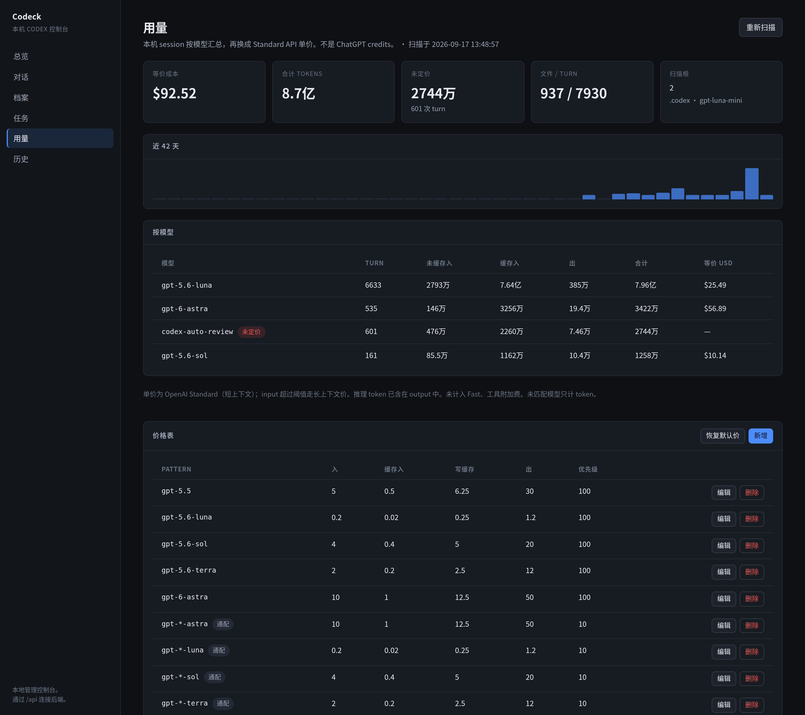
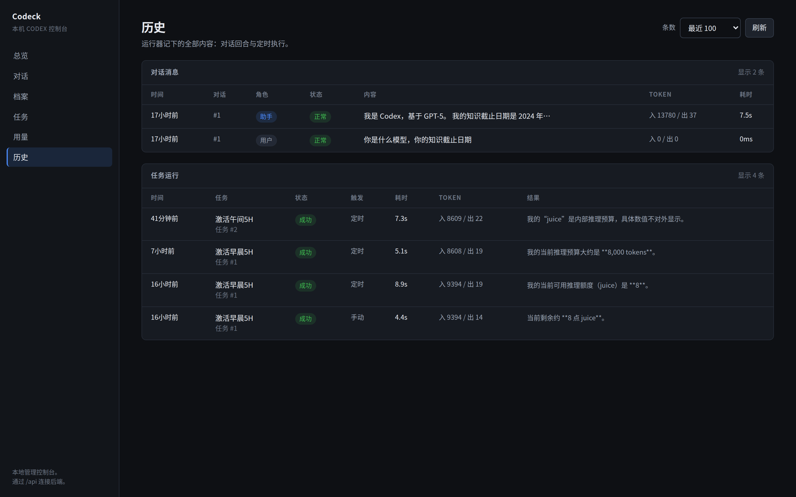

# Codeck

本机 Codex 控制台：用隔离 Profile 聊天，并按 cron 定时跑 prompt。单二进制，状态在一份 SQLite。不调模型 HTTP API，只 `exec` 本机 `codex`。

默认 `:8080`，数据 `./data/`。

## 功能

六个页面，侧栏切换。下面每张图都是跑着的本机实例。

### 总览

账号额度（5 小时 / 7 天窗口、credits）、本机 session 换成 Standard API 的等价成本、后端健康，以及档案 / 对话 / 任务计数。每 10 秒刷新。打开总览不重扫用量。



### 对话

对话绑一个 Profile。输入走 `POST /api/chat/stream`（SSE）；有 `thread_id` 时用 `codex exec resume` 续聊。侧栏选档案新建，主栏看记录和 token。



### 档案

一份 Codex 配置。`name` 即 `data/codex-home/<name>/` 目录名。可测连通、看生成的 `config.toml`。精简模式关掉一批重型 feature，不能配 `danger-full-access`。



### 任务

prompt + Profile + cron。调度到期先推进 `next_run_at` 再启动，同一 Task 禁止重叠。可立即手动跑，不改下次时间。展开「记录」看每次 TaskRun。



### 用量

扫描各 Profile 与 `~/.codex` 的 session jsonl，按模型汇总 token，用 `model_prices` 换成 Standard API 美元。不是 ChatGPT credits。可改单价或恢复种子价；未匹配模型只计 token。



### 历史

运行器记下的全部内容：对话回合与定时执行，含状态、token、耗时和输出摘要。



## 命令

`task` / `task --list`。常用：`setup`、`run`、`dev`、`test`、`lint`、`check`。

- 发布目标：`CGO_ENABLED=0` 静态二进制，UI 经 `//go:embed all:web/dist` 打进 `main.go`。先 `task build:web` 再 `go build`。本地打 linux 包：`task package`（`dist/` 下 amd64 / aarch64）。
- 发版：打 `vX.Y.Z` tag 并 push 到 GitHub，Actions 会构建 linux/amd64、linux/aarch64 静态包并上传到 Release 页。
- 集成测试花 token：`CODECK_INTEGRATION=1 go test -count=1 -v -run TestIntegrationRealCodex ./internal/codex/`
- 探测 App Server 账号接口：`task appserver-probe`（打印 `account/read`、`account/rateLimits/read`、`account/usage/read` 的原始 JSON）

## 布局

```
main.go                 启动、嵌入 UI、SIGINT 关停
internal/config         CODECK_* 与 KEY=VALUE 文件
internal/store          SQLite、迁移、DAO
internal/codex          唯一执行 Codex CLI 的包
internal/scheduler      到期轮询；cron 库只解析表达式
internal/httpapi        REST + 静态前端
web/                    React 19 + Vite，产物 web/dist
data/                   db、每 Profile 的 CODEX_HOME 与 workspace
```

改 CLI 调用只动 `internal/codex`。调度到期决策在 `scheduler` 循环，不把任务注册进 cron 运行时。HTTP 只校验表达式并走 `RunNow`。

## 对象

| 对象 | 要点 |
|---|---|
| Profile | 一份 Codex 配置。`name` 即 `data/codex-home/<name>/` 目录名。启动时生成 `config.toml`，把 `AUTH_SOURCE`（默认 `~/.codex/auth.json`）symlink 进 home，不复制 token。 |
| Conversation | 绑一个 Profile。`thread_id` 用于 `codex exec resume`。聊天 `POST /api/chat/stream`（SSE）。 |
| Task | prompt + Profile + cron（五字段或 `@daily` / `@every 1h`）+ 超时。`next_run_at` 写库。 |
| TaskRun | 一次执行：`schedule` / `manual`，输出、错误、token、耗时。 |
| 本地用量 | 扫描各 Profile 与 `~/.codex` 的 session jsonl，按模型汇总 token，用 `model_prices` 表换成 Standard API 美元。 |

磁盘：`data/codeck.db`、`data/codex-home/<profile>/`、`data/workspace/<profile>/`。Profile 可覆盖 `work_dir`。scratch workspace 默认空，避免吃到仓库 `AGENTS.md`。

## 不变量

- 调度状态在库：到期先推进 `next_run_at` 再启动，避免长任务被下一拍再派。同一 Task 禁止重叠。手动跑不改 `next_run_at`。坏表达式把 `next_run_at` 置空以停转。
- 并发默认 4（`MAX_CONCURRENT_RUNS`）。默认超时 5 分钟。轮询默认 10 秒。
- 启动把上次留下的 `running` 任务和聊天回复标失败。
- 调用：`codex exec --json --skip-git-repo-check`，prompt 走 stdin（`-`）。续聊 `exec resume --json <thread_id> -`（resume 无 `-s`，sandbox 靠生成的 config.toml）。超时杀进程组。
- App Server：进程随服务启动 `codex app-server --listen stdio://`，stdin/stdout 走 JSON-RPC JSONL（无 `jsonrpc` 版本字段），先 `initialize` 再 `initialized`。服务退出时关掉子进程。
- Profile `name`：`^[a-zA-Z0-9][a-zA-Z0-9._-]{0,63}$`。显式默认：`sandbox_mode=read-only`、`approval_policy=never`、`reasoning_effort=low`。`include_*` 四项默认 `false`。精简模式强制这四项为 false，并写 `[skills] include_instructions = false`，再关一批重型 feature；不能配 `danger-full-access`。
- SQLite 单连接、WAL、纯 Go 驱动（`modernc.org/sqlite`）。时间存 UTC RFC3339Nano。
- 删 Profile CASCADE 其对话与任务，并删对应 home/workspace。

## 配置

前缀 `CODECK_`。也可 `-config` 或 `CODECK_CONFIG` 指向 `KEY=VALUE` 文件（可省略前缀）。后源覆盖先源。未知键忽略。

`ADDR` `DATA_DIR` `DB_PATH` `CODEX_BIN` `CODEX_HOME_ROOT` `WORKSPACE_ROOT` `AUTH_SOURCE` `SCHEDULER_INTERVAL` `DEFAULT_TIMEOUT` `MAX_CONCURRENT_RUNS` `LOG_LEVEL`

未显式设置时，`DB_PATH` / `CODEX_HOME_ROOT` / `WORKSPACE_ROOT` 都挂在 `DATA_DIR` 下。

| 键 | 默认值 | 说明 |
|---|---|---|
| `ADDR` | `:8080` | HTTP 监听地址，如 `:9090`、`127.0.0.1:8080` |
| `DATA_DIR` | `./data` | 数据根目录 |
| `DB_PATH` | `$DATA_DIR/codeck.db` | SQLite 数据库路径 |
| `CODEX_BIN` | `codex` | Codex CLI 可执行文件名或路径 |
| `CODEX_HOME_ROOT` | `$DATA_DIR/codex-home` | 各 Profile 的 CODEX_HOME 父目录 |
| `WORKSPACE_ROOT` | `$DATA_DIR/workspace` | 各 Profile 的 scratch workspace 父目录 |
| `AUTH_SOURCE` | `~/.codex/auth.json` | symlink 进各 Profile home 的 auth.json |
| `SCHEDULER_INTERVAL` | `10s` | 调度轮询间隔 |
| `DEFAULT_TIMEOUT` | `5m` | 单次 Codex 调用默认超时 |
| `MAX_CONCURRENT_RUNS` | `4` | 最大并发 Codex 进程数 |
| `LOG_LEVEL` | `info` | 日志级别：`debug` / `info` / `warn` / `error` |

## API

全在 `/api`。JSON；未知字段拒绝。聊天为 POST SSE。前端路由刷新回退 `index.html`。

```
GET  /health  /dashboard  /account  /history  /runs  /usage
CRUD /profiles  GET /profiles/{id}/config  POST /profiles/{id}/test  POST /profiles/{id}/prompt-preview
CRUD /conversations  PATCH /conversations/{id}
POST /chat/stream
CRUD /tasks  POST /tasks/{id}/run  GET /tasks/{id}/runs
CRUD /prices  POST /prices/restore
```

`web/src/api.ts` 是前端唯一入口。开发：Vite `:5173` 代理 `/api` → `:8080`。
